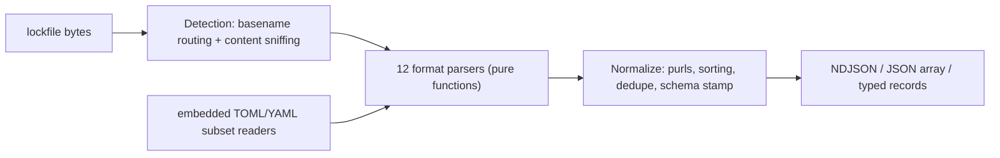

# anylock

[English](README.md) | [中文](README.zh.md) | [日本語](README.ja.md)

[](LICENSE)  [](CHANGELOG.md)  [](CONTRIBUTING.md)

**anylock：12 種類の lockfile フォーマットを単一の正規化 NDJSON スキーマに変換するゼロ依存パーサー——あらゆるセキュリティツールが書き直し続けてきた lockfile フロントエンドを、ライブラリ + CLI として。**


```bash
# not yet on npm — install from a checkout of this repository
npm install && npm run build && npm pack
npm install -g ./anylock-0.1.0.tgz
```

## なぜ anylock？

依存スキャナも SBOM 生成器もライセンス監査ツールも、みな同じ雑務から始まる：まず `package-lock.json` を解析し、次に `yarn.lock`（同じファイル名の下に互換性のない 2 形式）、さらに `pnpm-lock.yaml`、`Cargo.lock`、`go.sum`、`poetry.lock`、`Gemfile.lock`……そして各ツールがこの雑務を内々に、微妙に違うやり方で、たいていエッジケースを間違えて再実装している——pnpm の peer サフィックス付きキー、npm の workspace リンク、Bundler の感嘆符付き git gem、Poetry の `[package.dependencies]` が*最後の* `[[package]]` に付く仕様。エコシステム最良のパーサー群は syft や trivy の内部 Go パッケージとして閉じ込められ、外から import できず、出力形状もリリースごとに揺れる。anylock はそのフロントエンドを独立した部品にした：12 形式を入れると、文書化された 1 つのレコードスキーマが出てくる。purl、ハッシュ、scope 付きで、lockfile が本当に語らない箇所は正直に `unknown` と言う。依存ゼロ（TOML / YAML サブセットリーダーは内蔵で、サブセット外は誤読せずエラー）、完全オフライン、バイト単位で決定的——同じ lockfile からは常に同じ NDJSON が出るので、diff もハッシュ化も安心してできる。

|  | anylock | syft | trivy | 自前パース |
|---|---|---|---|---|
| ライブラリとして使える | 可——型付き API、あらゆる JS/TS ツールから | 内部 Go パッケージのみ | 内部 Go パッケージのみ | 永遠に自分で保守 |
| 出力スキーマ | 文書化・キー順固定・バージョン付き | SBOM 形式、リリースごとに変動 | レポート形式、リリースごとに変動 | なし |
| ランタイム依存 | 0 | Go モジュール約 70 個 | Go モジュール約 80 個 | まちまち |
| バイト単位の決定性 | あり——ソート + 固定キー順 | 保証なし | 保証なし | まれ |
| 直接依存 / dev scope | lockfile に記録があれば付与、なければ正直に `unknown` | 部分的 | 部分的 | たいてい省略 |
| パッケージごとの purl | あり、型別に仕様準拠 | あり | あり | scope/pypi でよく間違う |
| 守備範囲 | lockfile の解析だけ、他はしない | フル SBOM スイート | フルスキャナスイート | 一度に 1 形式 |

<sub>依存数は各プロジェクトの 2026-07 時点の lockfile / go.mod より。syft も trivy も優れたスキャナであり、比較はパーサーを再利用できるかという一点のみ。</sub>

## 特徴

- **12 形式、1 スキーマ**——npm（v1–v3）、Yarn classic と Berry、pnpm（5/6/9）、Cargo、go.sum、Poetry、Pipenv、ピン留め requirements.txt、Bundler、Composer、SwiftPM のすべてが同じ 11 キーのレコードに着地。文書は [docs/schema.md](docs/schema.md)。
- **本当のゼロ依存**——JSON は組み込み；Cargo、Poetry、pnpm、Berry が実際に出力する TOML / YAML サブセットは内蔵の小さなリーダーが解析し、サブセット外の内容には誤読せず `ParseError` を投げる。
- **正しい purl**——npm scope の namespace 化、pypi の PEP 503 正規化、golang/composer パスの小文字化と namespace 分割、swift 座標はリポジトリ URL から導出；誠実に構成できない場合は `null`。
- **正直な unknown**——lockfile が実際に記録している場合のみ（npm ルートエントリ、pnpm importers、Cargo workspace メンバー、Bundler DEPENDENCIES）`relation` が `direct`/`transitive` になる；go.sum の類は `unknown` と言い、決して推測しない。
- **バイト決定的な NDJSON**——レコードをソート、依存エッジをソート、キー順は固定；2 回の実行は `cmp` で完全一致し、出力は CI でキャッシュ・diff・ハッシュ化できる。
- **推測を拒む検出**——ファイル名ルーティングに加え、stdin 向けの構造的コンテンツスニッフィング；`yarn.lock` の classic / Berry 分岐も処理済みで、識別不能な入力はゴミを出さず終了コード 1 で終わる。
- **オフラインで寡黙**——渡されたバイトを読み、出力し、終了する；ネットワーク呼び出しなし、テレメトリなし、警告は stderr へ流し stdout は常に純粋な NDJSON。

## クイックスタート

インストール：

```bash
# not yet on npm — install from a checkout of this repository
npm install && npm run build && npm pack
npm install -g ./anylock-0.1.0.tgz
```

多言語リポジトリ（同梱の `examples/polyglot/`）を 1 本のストリームに解析：

```bash
anylock package-lock.json Cargo.lock go.sum requirements.txt
```

出力（実際の実行結果、5 レコード中 3 件を抜粋）：

```text
{"schema":1,"name":"ms","version":"2.1.3","ecosystem":"npm","purl":"pkg:npm/ms@2.1.3","integrity":[{"algorithm":"sha512","value":"6FlzubTLZG3J2a/NVCAleEhjzq5oxgHyaCU9yYXvcLsvoVaHJq/s5xXI6/XXP6tz7R9xAOtHnSO/tXtF3WRTlA=="}],"resolved":"https://registry.npmjs.org/ms/-/ms-2.1.3.tgz","relation":"direct","scopes":[],"dependencies":[],"source":{"format":"npm","path":"package-lock.json","lockfileVersion":"3"}}
{"schema":1,"name":"itoa","version":"1.0.11","ecosystem":"cargo","purl":"pkg:cargo/itoa@1.0.11","integrity":[{"algorithm":"sha256","value":"49f1f14873335454500d59611f1cf4a4b0f786f9ac11f4312a78e4cf2566695b"}],"resolved":"registry+https://github.com/rust-lang/crates.io-index","relation":"direct","scopes":[],"dependencies":[],"source":{"format":"cargo","path":"Cargo.lock","lockfileVersion":"4"}}
{"schema":1,"name":"github.com/google/uuid","version":"v1.6.0","ecosystem":"golang","purl":"pkg:golang/github.com/google/uuid@v1.6.0","integrity":[{"algorithm":"h1","value":"NIvaJDMOsjHA8n1jAhLSgzrAzy1Hgr+hNrb57e+94F0="},{"algorithm":"h1:go.mod","value":"TIyPZe4MgqvfeYDBFedMoGGpEw/LqOeaOT+nhxU+yHo="}],"resolved":null,"relation":"unknown","scopes":[],"dependencies":[],"source":{"format":"go-sum","path":"go.sum","lockfileVersion":null}}
```

ソース形式が何であれ 1 行 = 1 パッケージ——そのまま `jq` に流すか、API を使う：

```ts
import { parseLockfile } from "anylock";
const result = parseLockfile(content, { filename: "pnpm-lock.yaml" });
for (const pkg of result.packages) console.log(pkg.purl, pkg.relation);
```

`anylock stats` は全件出力せず要約する（同じディレクトリでの実出力）：

```text
package-lock.json	npm	npm	1 package
Cargo.lock	cargo	cargo	1 package
go.sum	go-sum	golang	1 package
requirements.txt	pip-requirements	pypi	2 packages
```

さらなるシナリオ（jq パイプライン、そのまま使える CI 完全性ゲート）は [examples/](examples/README.md) に。

## 対応フォーマット

形式ごとの詳細——対応バージョン、ハッシュの出所、直接依存サポート、意図的な除外——は [docs/formats.md](docs/formats.md) を参照。

| フォーマット id | Lockfile | エコシステム |
|---|---|---|
| `npm` | `package-lock.json`、`npm-shrinkwrap.json`（v1–v3） | npm |
| `yarn-classic` / `yarn-berry` | `yarn.lock`（v1 / v2+、内容で判別） | npm |
| `pnpm` | `pnpm-lock.yaml`（5.x、6.x、9.x） | npm |
| `cargo` | `Cargo.lock` | cargo |
| `go-sum` | `go.sum` | golang |
| `poetry` / `pipfile` / `pip-requirements` | `poetry.lock` / `Pipfile.lock` / ピン留め `requirements*.txt` | pypi |
| `gemfile` | `Gemfile.lock`、`gems.locked` | gem |
| `composer` | `composer.lock` | composer |
| `swiftpm` | `Package.resolved`（v1–v3） | swift |

## CLI リファレンス

`anylock parse [files…]` が既定のサブコマンド；`anylock detect` はファイルごとの形式を、`anylock stats` はファイルごとの件数を、`anylock formats` は上の表を出力する。`-` で stdin を読む。

| フラグ | 既定値 | 効果 |
|---|---|---|
| `--as <format>` | 自動検出 | 検出をスキップして形式 id を強制 |
| `--format ndjson\|json` | `ndjson` | 1 レコード 1 行、または単一の JSON 配列 |
| `-q, --quiet` | オフ | stderr のパーサー警告を抑制 |

終了コード：`0` 成功、`1` 1 つ以上のファイルが解析・検出に失敗、`2` 使い方の誤り——パイプラインが壊れた lockfile と壊れた呼び出しを区別できる。

## アーキテクチャ



## ロードマップ

- [x] 12 形式、正規化スキーマ rev 1、purl 規則、形式検出、CLI + 型付き API、テスト 90 件、smoke スクリプト（v0.1.0）
- [ ] 形式追加：`bun.lock`、`uv.lock`、`gradle.lockfile`、`mix.lock`、`packages.lock.json`（NuGet）
- [ ] `anylock diff`——安定スキーマの上に築くセマンティックな lockfile 差分（追加 / 削除 / 更新 / ソース変更）
- [ ] 任意の manifest 相互参照：`package.json` / `pyproject.toml` が lockfile の隣にあるとき `relation: unknown` を解決
- [ ] 数百 MB 級の巨大 lockfile 向けストリーミング解析

全リストは [open issues](https://github.com/JaydenCJ/anylock/issues) を参照。

## コントリビュート

コントリビュート歓迎。`npm install && npm run build` でビルドし、`npm test`（テスト 90 件）と `bash scripts/smoke.sh`（`SMOKE OK` を出力すること）を実行——このリポジトリは CI を持たず、上記の主張はすべてローカル実行で検証される。[CONTRIBUTING.md](CONTRIBUTING.md) を読み、[good first issue](https://github.com/JaydenCJ/anylock/issues?q=is%3Aissue+is%3Aopen+label%3A%22good+first+issue%22) を選ぶか、[discussion](https://github.com/JaydenCJ/anylock/discussions) を始めてほしい。

## ライセンス

[MIT](LICENSE)
