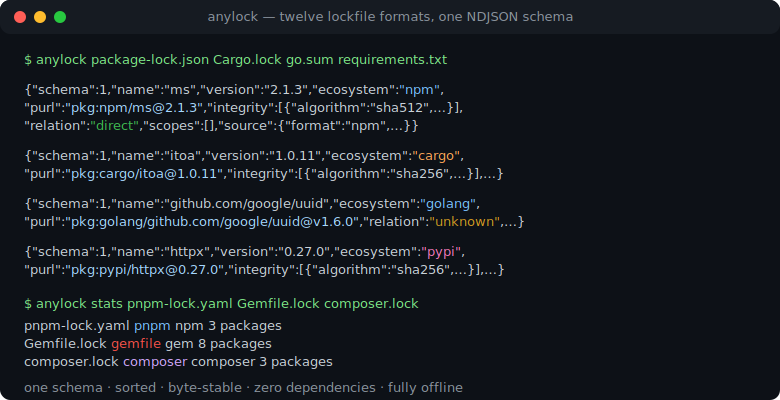
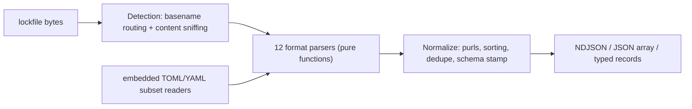

# anylock

[English](README.md) | [中文](README.zh.md) | [日本語](README.ja.md)

[](LICENSE)  [](CHANGELOG.md)  [](CONTRIBUTING.md)

**anylock：one zero-dependency parser turning twelve lockfile formats into a single normalized NDJSON schema — the lockfile front-end every security tool keeps rewriting, as a library and a CLI.**



```bash
# not yet on npm — install from a checkout of this repository
npm install && npm run build && npm pack
npm install -g ./anylock-0.1.0.tgz
```

## Why anylock?

Every dependency scanner, SBOM generator and license auditor starts with the same chore: parse `package-lock.json`, then `yarn.lock` (two incompatible formats under one name), then `pnpm-lock.yaml`, `Cargo.lock`, `go.sum`, `poetry.lock`, `Gemfile.lock`… and every tool re-implements that chore privately, slightly differently, and usually wrong at the edges — pnpm peer-suffixed keys, npm workspace links, Bundler's bang-suffixed git gems, Poetry's `[package.dependencies]` attaching to the *last* `[[package]]`. The best parsers in the ecosystem live inside syft and trivy as internal Go packages you cannot import from anywhere else, and their output shape shifts with each release. anylock is that front-end as a standalone unit: twelve formats in, one documented record schema out, with purls, hashes, scopes and an honest `unknown` where the lockfile genuinely does not say. It is dependency-free (the TOML and YAML subset readers are embedded and fail loudly outside their subset), fully offline, and byte-deterministic — the same lockfile always produces the same NDJSON, so you can diff it, hash it, and build on it.

|  | anylock | syft | trivy | hand-rolled parsing |
|---|---|---|---|---|
| Usable as a library | yes — typed API, any JS/TS tool | internal Go packages only | internal Go packages only | you own it forever |
| Output schema | documented, key-ordered, versioned | SBOM formats, shifts by release | report formats, shifts by release | none |
| Runtime dependencies | 0 | ~70 Go modules | ~80 Go modules | varies |
| Deterministic bytes | yes — sorted + fixed key order | not guaranteed | not guaranteed | rarely |
| Directness / dev scopes | where the lockfile records them, else honest `unknown` | partial | partial | usually skipped |
| purl per package | yes, spec rules per type | yes | yes | usually wrong for scopes/pypi |
| Scope | parse lockfiles, nothing else | full SBOM suite | full scanner suite | one format at a time |

<sub>Dependency counts from each project's lockfile / go.mod as of 2026-07. syft and trivy are excellent scanners — the comparison is only about reusing their parsers.</sub>

## Features

- **Twelve formats, one schema** — npm (v1–v3), Yarn classic and Berry, pnpm (5/6/9), Cargo, go.sum, Poetry, Pipenv, pinned requirements.txt, Bundler, Composer and SwiftPM all land in the same eleven-key record, documented in [docs/schema.md](docs/schema.md).
- **Zero dependencies, truly** — JSON is built in; the TOML and YAML subsets that Cargo, Poetry, pnpm and Berry emit are parsed by small embedded readers that raise `ParseError` on anything outside the subset instead of misparsing.
- **Correct purls** — npm scope namespaces, PEP 503 normalization for pypi, lowercased namespace-split golang/composer paths, repository-derived swift coordinates; `null` when a purl cannot be formed honestly.
- **Honest unknowns** — `relation` is `direct`/`transitive` only where the lockfile records it (npm root entry, pnpm importers, Cargo workspace members, Bundler DEPENDENCIES); go.sum and friends say `unknown`, never a guess.
- **Byte-deterministic NDJSON** — records sorted, dependency edges sorted, key order fixed; two runs are `cmp`-identical, so output can be cached, diffed and hashed in CI.
- **Detection that refuses to guess** — basename routing plus structural content sniffing for stdin; the classic-vs-Berry `yarn.lock` split is handled, and unrecognizable input exits 1 instead of producing garbage.
- **Offline and silent** — reads the bytes it is given, prints, exits; no network calls, no telemetry, warnings on stderr so stdout stays pure NDJSON.

## Quickstart

Install:

```bash
# not yet on npm — install from a checkout of this repository
npm install && npm run build && npm pack
npm install -g ./anylock-0.1.0.tgz
```

Parse a polyglot repository (the bundled `examples/polyglot/`) into one stream:

```bash
anylock package-lock.json Cargo.lock go.sum requirements.txt
```

Output (real captured run, abridged to 3 of the 5 records):

```text
{"schema":1,"name":"ms","version":"2.1.3","ecosystem":"npm","purl":"pkg:npm/ms@2.1.3","integrity":[{"algorithm":"sha512","value":"6FlzubTLZG3J2a/NVCAleEhjzq5oxgHyaCU9yYXvcLsvoVaHJq/s5xXI6/XXP6tz7R9xAOtHnSO/tXtF3WRTlA=="}],"resolved":"https://registry.npmjs.org/ms/-/ms-2.1.3.tgz","relation":"direct","scopes":[],"dependencies":[],"source":{"format":"npm","path":"package-lock.json","lockfileVersion":"3"}}
{"schema":1,"name":"itoa","version":"1.0.11","ecosystem":"cargo","purl":"pkg:cargo/itoa@1.0.11","integrity":[{"algorithm":"sha256","value":"49f1f14873335454500d59611f1cf4a4b0f786f9ac11f4312a78e4cf2566695b"}],"resolved":"registry+https://github.com/rust-lang/crates.io-index","relation":"direct","scopes":[],"dependencies":[],"source":{"format":"cargo","path":"Cargo.lock","lockfileVersion":"4"}}
{"schema":1,"name":"github.com/google/uuid","version":"v1.6.0","ecosystem":"golang","purl":"pkg:golang/github.com/google/uuid@v1.6.0","integrity":[{"algorithm":"h1","value":"NIvaJDMOsjHA8n1jAhLSgzrAzy1Hgr+hNrb57e+94F0="},{"algorithm":"h1:go.mod","value":"TIyPZe4MgqvfeYDBFedMoGGpEw/LqOeaOT+nhxU+yHo="}],"resolved":null,"relation":"unknown","scopes":[],"dependencies":[],"source":{"format":"go-sum","path":"go.sum","lockfileVersion":null}}
```

One record per package, whatever the source format — pipe it into `jq`, or use the API:

```ts
import { parseLockfile } from "anylock";
const result = parseLockfile(content, { filename: "pnpm-lock.yaml" });
for (const pkg of result.packages) console.log(pkg.purl, pkg.relation);
```

`anylock stats` summarizes instead of dumping (real output from the same directory):

```text
package-lock.json	npm	npm	1 package
Cargo.lock	cargo	cargo	1 package
go.sum	go-sum	golang	1 package
requirements.txt	pip-requirements	pypi	2 packages
```

More scenarios (jq pipelines, a copy-paste CI integrity gate) live in [examples/](examples/README.md).

## Supported formats

Full per-format detail — versions handled, hash sources, directness support, deliberate exclusions — is in [docs/formats.md](docs/formats.md).

| Format id | Lockfile | Ecosystem |
|---|---|---|
| `npm` | `package-lock.json`, `npm-shrinkwrap.json` (v1–v3) | npm |
| `yarn-classic` / `yarn-berry` | `yarn.lock` (v1 / v2+, split by content) | npm |
| `pnpm` | `pnpm-lock.yaml` (5.x, 6.x, 9.x) | npm |
| `cargo` | `Cargo.lock` | cargo |
| `go-sum` | `go.sum` | golang |
| `poetry` / `pipfile` / `pip-requirements` | `poetry.lock` / `Pipfile.lock` / pinned `requirements*.txt` | pypi |
| `gemfile` | `Gemfile.lock`, `gems.locked` | gem |
| `composer` | `composer.lock` | composer |
| `swiftpm` | `Package.resolved` (v1–v3) | swift |

## CLI reference

`anylock parse [files…]` is the default subcommand; `anylock detect` prints the format per file, `anylock stats` per-file counts, `anylock formats` the table above. Pass `-` to read stdin.

| Flag | Default | Effect |
|---|---|---|
| `--as <format>` | auto-detect | skip detection and force a format id |
| `--format ndjson\|json` | `ndjson` | one line per record, or a single JSON array |
| `-q, --quiet` | off | suppress parser warnings on stderr |

Exit codes: `0` success, `1` at least one file failed to parse or detect, `2` usage error — so a pipeline can tell a broken lockfile from a broken invocation.

## Architecture



## Roadmap

- [x] Twelve formats, normalized schema rev 1, purl rules, detection, CLI + typed API, 90 tests, smoke script (v0.1.0)
- [ ] More formats: `bun.lock`, `uv.lock`, `gradle.lockfile`, `mix.lock`, `packages.lock.json` (NuGet)
- [ ] `anylock diff` — semantic lockfile diffs (added / removed / bumped / retagged) built on the stable schema
- [ ] Optional manifest cross-reference to resolve `relation: unknown` where a `package.json` / `pyproject.toml` sits next to the lockfile
- [ ] Streaming parse for multi-hundred-megabyte lockfiles

See the [open issues](https://github.com/JaydenCJ/anylock/issues) for the full list.

## Contributing

Contributions are welcome. Build with `npm install && npm run build`, then run `npm test` (90 tests) and `bash scripts/smoke.sh` (must print `SMOKE OK`) — this repository ships no CI, every claim above is verified by local runs. See [CONTRIBUTING.md](CONTRIBUTING.md), grab a [good first issue](https://github.com/JaydenCJ/anylock/issues?q=is%3Aissue+is%3Aopen+label%3A%22good+first+issue%22), or start a [discussion](https://github.com/JaydenCJ/anylock/discussions).

## License

[MIT](LICENSE)
