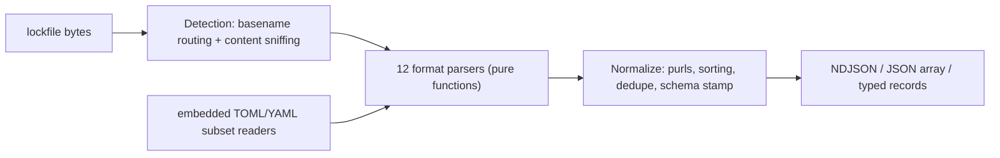

# anylock

[English](README.md) | [中文](README.zh.md) | [日本語](README.ja.md)

[](LICENSE)  [](CHANGELOG.md)  [](CONTRIBUTING.md)

**anylock：一个零依赖解析器，把十二种 lockfile 格式统一为单一规范化 NDJSON schema——每个安全工具都在重写的那层 lockfile 前端，做成了库 + CLI。**


```bash
# not yet on npm — install from a checkout of this repository
npm install && npm run build && npm pack
npm install -g ./anylock-0.1.0.tgz
```

## 为什么选 anylock？

每个依赖扫描器、SBOM 生成器和许可证审计工具都从同一件苦差事开始：先解析 `package-lock.json`，再解析 `yarn.lock`（同一个文件名下两种互不兼容的格式），然后是 `pnpm-lock.yaml`、`Cargo.lock`、`go.sum`、`poetry.lock`、`Gemfile.lock`……而每个工具都在私下重新实现这件事，各有微妙差异，而且在边界情况上通常是错的——pnpm 带 peer 后缀的键、npm workspace 链接、Bundler 带感叹号的 git gem、Poetry 的 `[package.dependencies]` 附着在*最后一个* `[[package]]` 上。生态中最好的解析器藏在 syft 和 trivy 内部，是无法从别处导入的内部 Go 包，输出形状还随版本漂移。anylock 把这层前端做成独立单元：十二种格式进来，一个有文档的记录 schema 出去，带 purl、哈希、scope，以及在 lockfile 确实没说时诚实的 `unknown`。它零依赖（TOML 和 YAML 子集读取器内嵌，超出子集就报错而不是误读）、完全离线、字节级确定——同一个 lockfile 永远产出相同的 NDJSON，可以 diff、可以哈希、可以放心构建于其上。

|  | anylock | syft | trivy | 手写解析 |
|---|---|---|---|---|
| 可作为库使用 | 可以——带类型 API，任何 JS/TS 工具 | 仅内部 Go 包 | 仅内部 Go 包 | 你要永远维护它 |
| 输出 schema | 有文档、键序固定、有版本 | SBOM 格式，随版本漂移 | 报告格式，随版本漂移 | 没有 |
| 运行时依赖 | 0 | 约 70 个 Go 模块 | 约 80 个 Go 模块 | 不一定 |
| 字节级确定性 | 有——排序 + 固定键序 | 不保证 | 不保证 | 很少 |
| 直接依赖 / dev scope | lockfile 有记录就给，否则诚实的 `unknown` | 部分 | 部分 | 通常直接跳过 |
| 每个包的 purl | 有，按类型遵循规范规则 | 有 | 有 | scope/pypi 通常搞错 |
| 定位 | 只解析 lockfile，别的不做 | 完整 SBOM 套件 | 完整扫描器套件 | 一次一种格式 |

<sub>依赖数量取自各项目 2026-07 时的 lockfile / go.mod。syft 和 trivy 都是优秀的扫描器——这里比较的只是能否复用它们的解析器。</sub>

## 特性

- **十二种格式，一个 schema**——npm（v1–v3）、Yarn classic 和 Berry、pnpm（5/6/9）、Cargo、go.sum、Poetry、Pipenv、锁定的 requirements.txt、Bundler、Composer 和 SwiftPM，全部落到同一个十一键记录里，文档见 [docs/schema.md](docs/schema.md)。
- **真正的零依赖**——JSON 是内置的；Cargo、Poetry、pnpm、Berry 实际输出的 TOML 和 YAML 子集由内嵌的小型读取器解析，遇到子集之外的内容抛 `ParseError` 而不是误读。
- **正确的 purl**——npm scope 命名空间、pypi 的 PEP 503 规范化、golang/composer 路径小写并拆分命名空间、swift 坐标从仓库 URL 推导；无法诚实构造时返回 `null`。
- **诚实的 unknown**——只有 lockfile 真正记录时（npm 根条目、pnpm importers、Cargo workspace 成员、Bundler DEPENDENCIES），`relation` 才是 `direct`/`transitive`；go.sum 之类就说 `unknown`，绝不猜。
- **字节级确定的 NDJSON**——记录排序、依赖边排序、键序固定；两次运行 `cmp` 完全一致，输出可以在 CI 里缓存、diff 和哈希。
- **拒绝乱猜的检测**——文件名路由加上针对 stdin 的结构化内容嗅探；`yarn.lock` 的 classic 与 Berry 之分已处理，识别不了的输入以退出码 1 结束而不是产出垃圾。
- **离线且安静**——读入给它的字节、打印、退出；无网络调用、无遥测，警告走 stderr，stdout 始终是纯 NDJSON。

## 快速上手

安装：

```bash
# not yet on npm — install from a checkout of this repository
npm install && npm run build && npm pack
npm install -g ./anylock-0.1.0.tgz
```

把一个多语言仓库（自带的 `examples/polyglot/`）解析成一条流：

```bash
anylock package-lock.json Cargo.lock go.sum requirements.txt
```

输出（真实运行结果，节选 5 条记录中的 3 条）：

```text
{"schema":1,"name":"ms","version":"2.1.3","ecosystem":"npm","purl":"pkg:npm/ms@2.1.3","integrity":[{"algorithm":"sha512","value":"6FlzubTLZG3J2a/NVCAleEhjzq5oxgHyaCU9yYXvcLsvoVaHJq/s5xXI6/XXP6tz7R9xAOtHnSO/tXtF3WRTlA=="}],"resolved":"https://registry.npmjs.org/ms/-/ms-2.1.3.tgz","relation":"direct","scopes":[],"dependencies":[],"source":{"format":"npm","path":"package-lock.json","lockfileVersion":"3"}}
{"schema":1,"name":"itoa","version":"1.0.11","ecosystem":"cargo","purl":"pkg:cargo/itoa@1.0.11","integrity":[{"algorithm":"sha256","value":"49f1f14873335454500d59611f1cf4a4b0f786f9ac11f4312a78e4cf2566695b"}],"resolved":"registry+https://github.com/rust-lang/crates.io-index","relation":"direct","scopes":[],"dependencies":[],"source":{"format":"cargo","path":"Cargo.lock","lockfileVersion":"4"}}
{"schema":1,"name":"github.com/google/uuid","version":"v1.6.0","ecosystem":"golang","purl":"pkg:golang/github.com/google/uuid@v1.6.0","integrity":[{"algorithm":"h1","value":"NIvaJDMOsjHA8n1jAhLSgzrAzy1Hgr+hNrb57e+94F0="},{"algorithm":"h1:go.mod","value":"TIyPZe4MgqvfeYDBFedMoGGpEw/LqOeaOT+nhxU+yHo="}],"resolved":null,"relation":"unknown","scopes":[],"dependencies":[],"source":{"format":"go-sum","path":"go.sum","lockfileVersion":null}}
```

无论源格式是什么，每行都是一个包——直接接 `jq`，或者用 API：

```ts
import { parseLockfile } from "anylock";
const result = parseLockfile(content, { filename: "pnpm-lock.yaml" });
for (const pkg of result.packages) console.log(pkg.purl, pkg.relation);
```

`anylock stats` 只做汇总不倾倒全量（同一目录的真实输出）：

```text
package-lock.json	npm	npm	1 package
Cargo.lock	cargo	cargo	1 package
go.sum	go-sum	golang	1 package
requirements.txt	pip-requirements	pypi	2 packages
```

更多场景（jq 流水线、可直接照抄的 CI 完整性门禁）见 [examples/](examples/README.md)。

## 支持的格式

每种格式的完整细节——覆盖的版本、哈希来源、直接依赖支持、有意的排除项——见 [docs/formats.md](docs/formats.md)。

| 格式 id | Lockfile | 生态 |
|---|---|---|
| `npm` | `package-lock.json`、`npm-shrinkwrap.json`（v1–v3） | npm |
| `yarn-classic` / `yarn-berry` | `yarn.lock`（v1 / v2+，按内容区分） | npm |
| `pnpm` | `pnpm-lock.yaml`（5.x、6.x、9.x） | npm |
| `cargo` | `Cargo.lock` | cargo |
| `go-sum` | `go.sum` | golang |
| `poetry` / `pipfile` / `pip-requirements` | `poetry.lock` / `Pipfile.lock` / 锁定的 `requirements*.txt` | pypi |
| `gemfile` | `Gemfile.lock`、`gems.locked` | gem |
| `composer` | `composer.lock` | composer |
| `swiftpm` | `Package.resolved`（v1–v3） | swift |

## CLI 参考

`anylock parse [files…]` 是默认子命令；`anylock detect` 打印每个文件的格式，`anylock stats` 打印每个文件的计数，`anylock formats` 打印上面的表格。传 `-` 读取 stdin。

| 选项 | 默认值 | 作用 |
|---|---|---|
| `--as <format>` | 自动检测 | 跳过检测，强制指定格式 id |
| `--format ndjson\|json` | `ndjson` | 每条记录一行，或单个 JSON 数组 |
| `-q, --quiet` | 关闭 | 抑制 stderr 上的解析警告 |

退出码：`0` 成功，`1` 至少一个文件解析或检测失败，`2` 用法错误——流水线能区分坏 lockfile 和坏命令行。

## 架构



## 路线图

- [x] 十二种格式、规范化 schema rev 1、purl 规则、格式检测、CLI + 类型化 API、90 个测试、smoke 脚本（v0.1.0）
- [ ] 更多格式：`bun.lock`、`uv.lock`、`gradle.lockfile`、`mix.lock`、`packages.lock.json`（NuGet）
- [ ] `anylock diff`——基于稳定 schema 的语义化 lockfile 对比（新增 / 移除 / 升级 / 换源）
- [ ] 可选的 manifest 交叉引用：当 `package.json` / `pyproject.toml` 就在 lockfile 旁边时解开 `relation: unknown`
- [ ] 面向数百 MB 巨型 lockfile 的流式解析

完整列表见 [open issues](https://github.com/JaydenCJ/anylock/issues)。

## 参与贡献

欢迎贡献。先 `npm install && npm run build` 构建，然后运行 `npm test`（90 个测试）和 `bash scripts/smoke.sh`（必须打印 `SMOKE OK`）——本仓库不带 CI，上面的每一条主张都由本地运行验证。参见 [CONTRIBUTING.md](CONTRIBUTING.md)，认领一个 [good first issue](https://github.com/JaydenCJ/anylock/issues?q=is%3Aissue+is%3Aopen+label%3A%22good+first+issue%22)，或发起 [discussion](https://github.com/JaydenCJ/anylock/discussions)。

## 许可证

[MIT](LICENSE)
